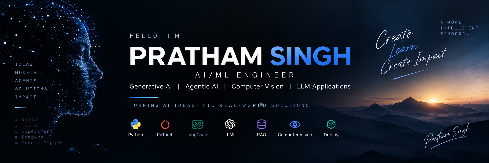

<p align="center">
  
</p>
# Hi, I'm Pratham Singh 👋

### AI/ML Engineer | Generative AI | Agentic AI | Computer Vision

I'm a **Computer Science & Engineering student specializing in Artificial Intelligence & Machine Learning**, focused on building practical AI systems using **LLMs, multi-agent architectures, retrieval systems, and deep learning**.

I'm particularly interested in turning AI research concepts into **reliable, evaluated, and production-oriented applications**.

---

## 🧠 Areas of Focus

* 🤖 **Agentic AI & Multi-Agent Systems**
* 🧠 **LLM & Generative AI Applications**
* 🔎 **RAG & Retrieval Systems**
* 🎯 **LLM Fine-Tuning & Model Adaptation**
* 👁️ **Computer Vision & Explainable AI**
* 🧪 **AI Evaluation & Reliability**
* ⚙️ **Production AI Systems**

---

## 🛠️ Tech Stack

### Programming & Data

`Python` `C++` `SQL` `Pandas` `NumPy`

### Machine Learning & Deep Learning

`PyTorch` `TensorFlow` `Scikit-learn` `OpenCV` `CNN` `Vision Transformers`

### Generative AI & LLMs

`Transformers` `Hugging Face` `Prompt Engineering` `RAG` `Embeddings` `Vector Databases` `Semantic Search` `Reranking`

### Agentic AI

`LangChain` `LangGraph` `Multi-Agent Systems` `Tool Calling` `Agent Orchestration` `Structured Outputs`

### LLM Engineering

`PEFT` `LoRA` `QLoRA` `TRL` `Fine-Tuning` `Quantization`

### Backend & Deployment

`FastAPI` `Docker` `Git` `GitHub`

---

# 🚀 Featured Projects

## 🤖 Multi-Agent Research & Analysis System

**Status: ✅ Completed**

A modular multi-agent AI system designed to research questions, analyze evidence, fact-check claims, validate citations, and generate structured research reports.

### Architecture

```text
User Query
    ↓
Supervisor
    ↓
Researcher
    ↓
┌───────────────┬────────────────┐
↓               ↓                ↓
Quick        Standard          Verified
↓               ↓                ↓
Reporter      Analyst         Analyst
                                  ↓
                             Fact Checker
                                  ↓
                              Reporter
                                  ↓
                         Citation Validator
                                  ↓
                             LLM Judge
                                  ↓
                           Final Evaluation
```

### Core Technologies

`Python` `LangGraph` `LangChain` `Gemini` `Tavily` `Pydantic` `Pytest`

### Key Engineering Concepts

* Multi-agent orchestration
* Dynamic workflow routing
* Web research and tool calling
* Structured outputs
* Fact checking
* Citation validation
* Citation-aware regeneration
* LLM-as-a-Judge evaluation
* Automated testing

**Test Suite:** 32 automated tests

🔗 **[View Repository](https://github.com/PrathmSingh/multi-agent-research-analysis-system)**

---

## 🛡️ DeepShield — Explainable Deepfake Detection

**Status: 🚧 Under Development**

An explainable deepfake detection system combining **CNN and Vision Transformer (ViT)** models with ensemble learning and explainable AI.

### Core Technologies

`Python` `PyTorch` `CNN` `Vision Transformer` `OpenCV` `Grad-CAM` `Attention Rollout`

### Key Concepts

* CNN-based deepfake detection
* Vision Transformer classification
* CNN + ViT ensemble
* Grad-CAM visualization
* Vision Transformer Attention Rollout
* Explainable AI

🔗 **[View Repository](https://github.com/PrathmSingh/DeepSheild)**

---

# 🔭 Upcoming AI Projects

### 🔎 Enterprise Knowledge Intelligence System

**Status: 📌 Planned**

An enterprise-style RAG system focused on advanced retrieval architecture rather than a basic PDF chatbot.

**Planned capabilities:**

`Document Ingestion` → `Embeddings` → `Vector Database` → `Hybrid Search` → `Reranking` → `Query Rewriting` → `Context Retrieval` → `LLM Generation` → `Citations` → `RAG Evaluation`

---

### 🧠 Domain-Specific LLM Fine-Tuning

**Status: 📌 Planned**

A complete model-adaptation pipeline demonstrating practical LLM fine-tuning.

```text
Base LLM
   ↓
Domain Dataset
   ↓
Instruction Formatting
   ↓
LoRA / QLoRA
   ↓
Fine-Tuning
   ↓
Evaluation
   ↓
Quantization
   ↓
Efficient Inference
```

**Technologies:**
`PyTorch` `Transformers` `Hugging Face` `PEFT` `TRL` `LoRA` `QLoRA`

---

### ⚙️ AI-Powered Intelligent Assistant

**Status: 📌 Planned**

A production-oriented AI application combining LLMs, RAG, tools, memory, APIs, and streaming responses.

```text
User
 ↓
FastAPI
 ↓
AI Assistant
 ├── LLM
 ├── RAG
 ├── Memory
 └── Tools
 ↓
Response
```

**Technologies:**
`LLM` `RAG` `Tool Calling` `Memory` `FastAPI` `PostgreSQL` `Docker`

---

# 📚 Currently Learning

* Advanced LLM application architecture
* Agentic AI and multi-agent workflows
* RAG optimization and retrieval evaluation
* LLM fine-tuning with LoRA / QLoRA
* LLM evaluation and reliability
* AI security and guardrails
* Production AI deployment
* LLM observability and monitoring

---

# 🎯 Engineering Philosophy

> **Build AI systems that are not only intelligent, but also reliable, explainable, and measurable.**

---

# 🤝 Let's Connect

📧 **[prathamsingh0065@gmail.com](mailto:prathamsingh0065@gmail.com)**

💼 **[LinkedIn](https://www.linkedin.com/in/prathmsingh/)**

💻 **[GitHub](https://github.com/PrathmSingh)**

---

⭐ If you find one of my projects interesting, feel free to explore the repository.
